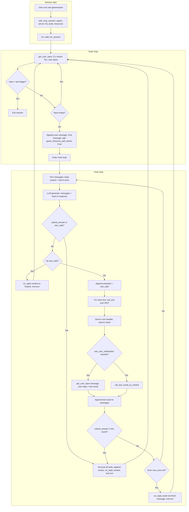

# End-to-End Client Flow (CLI chat client)

End-to-end flow from starting the server through user input, tool calls, final answer, and the next user message.

## Session start

| Step | Where | What happens |
|------|--------|----------------|
| 1 | CLI | User runs `ask-gamemaster`. CLI calls `with_mcp_session()`. |
| 2 | `mcp_client.with_mcp_session` | Spawn MCP server subprocess (stdio), initialize session, `list_tools()`, fetch resources. Yields `(session, openai_tools, server_instructions, resources)`. |
| 3 | CLI | Build system prompt, show rulebook status, then call `run_session(session, openai_tools, llm, get_user_input, on_reply, ...)`. One runner invocation for the whole chat. |

## Outer loop: get next user message

| Step | Where | What happens |
|------|--------|----------------|
| 4 | `run_session` | Call `get_user_input(None)` — CLI shows "You" and prompt; user types a line. |
| 5 | `run_session` | If user input is the quit trigger (e.g. `/quit`), exit session. If empty, re-prompt (no quit). Otherwise append `{"role": "user", "content": ...}` to `messages`. First user message only: optionally prefix content with `game_id` / `source_pdf_names` from CLI args. |
| 6 | `run_session` | Enter inner loop to produce this turn’s reply. |

## Inner loop: LLM + tools until turn ends

| Step | Where | What happens |
|------|--------|----------------|
| 7 | `run_session` | If `messages` exceeds context limit, trim: keep system message and last N full turns (sliding window). |
| 8 | `run_session` + `llm.generate()` | Send `messages` + tools to LLM; get response (content + optional `tool_calls`). |
| 9 | `run_session` | **Turn end (a):** If any tool call is `submit_answer(content=...)` — extract `content`, append assistant message and all tool results (after executing tools, see below), call `on_reply(content)`, then exit inner loop → go to step 4 for next user message. |
| 10 | `run_session` | **Turn end (b):** If no tool calls and non-empty content (or after `llm.finalize` if empty) — append assistant message if needed, call `on_reply(text)`, exit inner loop → go to step 4. |
| 11 | `run_session` | **Otherwise:** Append assistant message with `tool_calls`. For each tool call: |

## Tool execution (within inner loop)

| Step | Where | What happens |
|------|--------|----------------|
| 12 | `run_session` | `session.call_tool(name, arguments)` over MCP (JSON-RPC over stdio). |
| 13 | MCP server (FastMCP) | Receives `tools/call`, runs middleware, invokes registered handler (e.g. `search_rules`, `ask_user_clarification`, `submit_answer`). |
| 14 | Server → client | Returns MCP `CallToolResult`. |
| 15 | `run_session` | **ask_user_clarification:** If result is sentinel `{client_action: "prompt_user", message: "..."}`, call `get_user_input(message)` — CLI shows message as Gamemaster, user types reply; use that reply as the tool result string. **Other tools:** `call_tool_result_to_content(mcp_result)` → string. |
| 16 | `run_session` | Append `{"role": "tool", "tool_call_id", "name", "content": result}` to `messages`. |
| 17 | `run_session` | If `submit_answer` was among this round’s tool calls, treat as turn end (step 9). Else go to step 7 (next inner iteration). |

## After turn ends

| Step | Where | What happens |
|------|--------|----------------|
| 18 | CLI | `on_reply(text)` was called; CLI shows "Gamemaster" and the reply (e.g. typing effect). |
| 19 | `run_session` | Back to step 4: call `get_user_input(None)` for the next user message. Conversation history is preserved in `messages` until trim. |

If the inner loop hits `max_turns` without a turn end, the runner calls `on_reply("I couldn't finish this; try rephrasing or asking something else.")` and then goes back to step 4.

---

## Flow diagram

