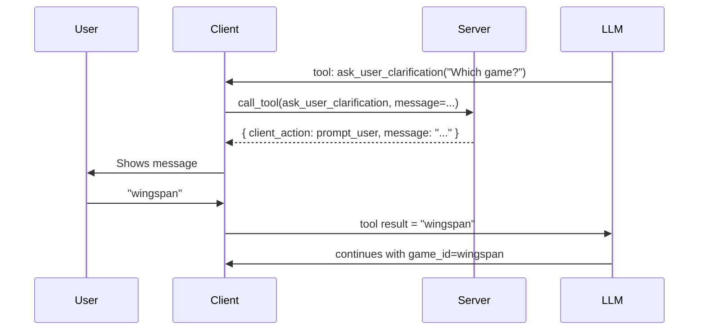

```mermaid
sequenceDiagram
  participant User
  participant Client
  participant Server
  participant LLM

  LLM->>Client: tool: ask_user_clarification("Which game?")
  Client->>Server: call_tool(ask_user_clarification, message=...)
  Server-->>Client: { client_action: prompt_user, message: "..." }
  Client->>User: Shows message
  User->>Client: "wingspan"
  Client->>LLM: tool result = "wingspan"
  LLM->>Client: continues with game_id=wingspan
```